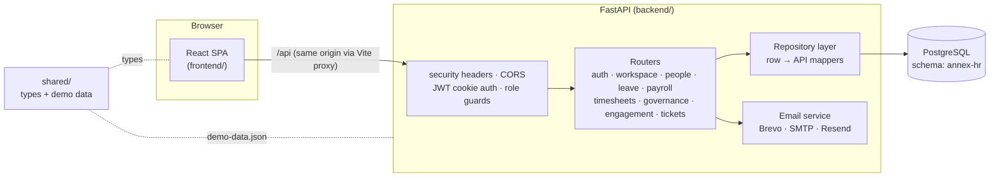

<div align="center">


# ANNEX HR

**HR and payroll software for African companies.**
Hire, pay and manage your team in one place — from first day to final pay.


A product of **Annex Technologies Limited**

</div>

---

## Contents

1. [What Annex HR does](#what-annex-hr-does)
2. [Feature overview](#feature-overview)
3. [Architecture](#architecture)
4. [Repository layout](#repository-layout)
5. [Getting started](#getting-started)
6. [Configuration](#configuration)
7. [Database](#database)
8. [Authentication, tenancy and roles](#authentication-tenancy-and-roles)
9. [API reference](#api-reference)
10. [Frontend](#frontend)
11. [Demo workspaces and accounts](#demo-workspaces-and-accounts)
12. [Scripts](#scripts)
13. [Deployment](#deployment)
14. [Security](#security)
15. [Troubleshooting](#troubleshooting)
16. [Roadmap](#roadmap)
17. [Contributing](#contributing)

---

## What Annex HR does

Annex HR is a multi-tenant HR platform. Every company gets its own isolated workspace (for example `annex.annexhr.com`). HR teams invite employees, and the platform then runs the whole employee lifecycle:

> **Onboard** new hires → **track** time and leave → **pay** staff and consultants with Kenyan statutory deductions → **review** performance → **stay compliant** → **offboard** cleanly.

It is built for East African employers first. PAYE, SHIF, NSSF, the Affordable Housing Levy, KRA PINs and local public holidays are built in, not bolted on.

## Feature overview

| Area | What's included |
| --- | --- |
| **Onboarding** | Self-service checklist (ID, KRA PIN, SHIF, NSSF, passport, NDA, emergency contact, bank details), progress tracking for HR, automatic reminders, welcome page, policy acknowledgement with signature and version history, probation countdowns with 30/60/90-day reminders |
| **Time & attendance** | Clock in/out with live timer, geolocation placeholder, weekly view, calendar, attendance heatmap, late arrivals and overtime |
| **Consultant timesheets** | Weekly timesheet grid by project, billable hours, manager approval queue, monthly summary, approval reminders |
| **Leave** | Balance cards (annual, sick, maternity, paternity, compassionate, study), working-day calculation that skips weekends and holidays, approval routing Manager → HR → CEO, handover notes, team calendar, holiday calendars, accrual charts |
| **Payroll** | Payroll runs with PAYE, SHIF, NSSF and Housing Levy, allowances and deductions, Finance → HR → CEO approval chain, Odoo sync placeholder, consultant payouts, final dues |
| **Bonus engine** | Quarterly-review bonus rules with a performance threshold, a live calculator, a budget cap and an approval flow |
| **Performance** | KPIs and balanced scorecards, OKRs, quarterly self, manager and peer reviews, rating trends, promotion readiness, a 9-box talent matrix and succession planning |
| **Engagement** | Pulse survey builder, anonymous responses, emoji and NPS questions, engagement score, department comparison |
| **Compliance** | Employee documents with expiry tracking (passport, work visa, driving licence, contracts, certificates, good conduct), reminder automation, audit-ready employee files |
| **Documents** | Folders, upload, preview, download and version history |
| **Disciplinary & grievance** | Confidential case logging, evidence, investigation timeline, manager and HR notes, approval stages, access logging |
| **Offboarding** | Resignation workflow, notice-period countdown, handover and knowledge transfer, asset recovery (laptop, access card, SIM, email, GitHub, Slack), exit interview, final settlement |
| **Tickets** | Linear-style helpdesk: submit tickets to Engineering, IT Support, People & HR, Finance or Facilities; list and board views, statuses, priorities, labels, assignees, comments, keyboard shortcuts (`C` to create). HR tickets are private to the reporter, assignee and HR. |
| **Reports** | Headcount, turnover, retention, leave, payroll, performance, recruitment, attendance and department analytics, with PDF and Excel export |
| **Platform** | Workspace switcher, role-based navigation, notification centre, `⌘K` command palette, dark mode, responsive layouts from phone to desktop |

## Architecture



**Design principles**

- **One contract.** `shared/src/types.ts` defines every domain type (`Employee`, `LeaveRequest`, `PayrollRun`, …). The frontend imports them, and the Python mappers in `backend/api/repository.py` return exactly those shapes.
- **The server enforces access.** The UI hides what a role can't use, and the API independently checks roles, scopes every query to the caller's workspace, and redacts sensitive fields.
- **Few database round trips.** The whole workspace loads in a single SQL statement (collections aggregated with `json_agg`), which matters on managed plans with small connection limits.
- **Plain SQL.** Migrations are hand-written SQL files. There's no ORM to learn, and the schema is readable at a glance.

## Repository layout

```
annex-hr/
├── .env.example              # configuration template (copy to .env)
├── .gitignore
├── package.json              # npm workspaces + root scripts
├── README.md
│
├── frontend/                 # React 19 · Vite · TypeScript · Tailwind CSS v4
│   ├── index.html
│   ├── public/               # favicons, web manifest, brand/ logo assets
│   └── src/
│       ├── App.tsx           # routes, auth guard, role guard
│       ├── main.tsx          # providers (theme, auth, tooltips, toasts)
│       ├── index.css         # design tokens (light + dark)
│       ├── components/
│       │   ├── ui/           # shadcn-style primitives (Radix based)
│       │   ├── shared/       # DataTable, StatCard, Stepper, Timeline, Kanban, FileUploader, …
│       │   ├── charts/       # ChartKit: validated palette, tooltip, legend
│       │   └── layout/       # AppShell, Sidebar, Topbar, MobileNav, CommandPalette
│       ├── context/          # auth (session + workspace data), theme, notifications
│       ├── lib/              # api client, rbac, utils
│       └── pages/
│           ├── landing/      # marketing site
│           ├── auth/         # login, signup wizard, forgot password, accept invite
│           └── app/          # one page (plus helper folder) per HR module
│
├── backend/                  # Python · FastAPI · psycopg 3 · pydantic
│   ├── requirements.txt
│   ├── api/
│   │   ├── main.py           # app, middleware, router mounting  (uvicorn api.main:app)
│   │   ├── config.py         # validated settings from the root .env
│   │   ├── db.py             # connection pool (search_path pinned to DB_SCHEMA), query helpers
│   │   ├── security.py       # JWT cookie sessions, role guards, passwords, rate limits
│   │   ├── repository.py     # row → API mappers, single-query workspace bootstrap
│   │   ├── errors.py · roles.py · audit.py · payroll_calc.py
│   │   ├── email/            # provider fallback (Brevo → SMTP → Resend) + branded templates
│   │   └── routers/          # auth, workspace, people, leave, payroll, timesheets,
│   │                         # governance, engagement, tickets
│   └── db/
│       ├── migrations/       # 001_initial_schema.sql, 002_tickets.sql, 003_email_flows.sql
│       ├── migrate.py        # python -m db.migrate [--reset]
│       ├── seed.py           # python -m db.seed [--force]
│       └── demo-data.json    # generated from shared/src/seed.ts
│
└── shared/                   # @annex/shared
    └── src/
        ├── types.ts          # domain model
        └── seed.ts           # deterministic demo workspaces
    └── scripts/export-demo-data.ts   # writes backend/db/demo-data.json
```

## Getting started

### Prerequisites

| Tool | Version |
| --- | --- |
| Node.js | 22 LTS or newer (frontend) |
| Python | 3.11 or newer (backend) |
| npm | 10 or newer |
| PostgreSQL | 14 or newer (local, or a managed service such as Aiven) |

### Setup

```bash
# 1. Install the frontend and the Python backend
npm install
npm run setup:backend        # creates backend/.venv and installs requirements.txt

# 2. Configure
cp .env.example .env
#    → fill in DB_* values and generate a JWT secret:
python3 -c "import secrets; print(secrets.token_urlsafe(48))"

# 3. Create the schema once (Annex HR never creates or drops schemas itself)
#    psql: CREATE SCHEMA "annex-hr";

# 4. Create tables and load demo data
npm run db:migrate
npm run db:seed

# 5. Run everything (API + web app)
npm run dev
```

Or run the API on its own from `backend/`:

```bash
cd backend
source .venv/bin/activate
uvicorn api.main:app --reload --port 8000
```

| Service | URL |
| --- | --- |
| Web app | http://localhost:5173 |
| API | http://localhost:8000/api (proxied from the web app at `/api`) |
| Health check | http://localhost:8000/api/health |
| Interactive API docs | http://localhost:8000/api/docs |

> **No database yet?** Set `VITE_USE_MOCK_API=true` and run `npm run dev:frontend`. The UI then runs entirely on in-browser demo data.

## Configuration

All configuration lives in a single `.env` at the repository root, shared by both apps. The backend validates it on start-up and refuses to boot with a clear message if something is missing.

| Variable | Default | Description |
| --- | --- | --- |
| `NODE_ENV` | `development` | `development`, `production` or `test` |
| `DB_HOST` · `DB_PORT` · `DB_NAME` | — | PostgreSQL connection |
| `DB_USER` · `DB_PASSWORD` | — | Database credentials (quote values containing `#`) |
| `DB_SCHEMA` | `annex-hr` | Schema holding every Annex HR table |
| `DB_SSL` | `false` | Use TLS (required for Aiven) |
| `DB_SSL_CA_PATH` | *(empty)* | Path to the provider's CA certificate. When set, the server certificate is verified |
| `DB_POOL_MAX` | `4` | Maximum pooled connections for the API |
| `API_PORT` | `8000` | API port (the Vite proxy forwards `/api` here) |
| `APP_URL` | `http://localhost:5173` | Public web-app URL used in email links |
| `CORS_ORIGINS` | `http://localhost:5173` | Comma-separated list of allowed origins |
| `JWT_SECRET` | — | At least 32 random characters |
| `JWT_EXPIRES_IN` | `7d` | Session lifetime |
| `COOKIE_NAME` | `annex_session` | Session cookie name |
| `COOKIE_SECURE` | `false` | Secure-only cookie (always on in production) |
| `ENABLE_DEMO_LOGIN` | `false` | One-click demo roles and the "View as" switcher. **Disable in production.** |
| `SEED_DEFAULT_PASSWORD` | — | Password given to every seeded demo user |
| `EMAIL_PROVIDER` | `auto` | `auto` (Resend → Brevo → SMTP) or an ordered list such as `brevo,smtp`. With nothing configured, emails are printed to the API console |
| `EMAIL_FROM_NAME` · `EMAIL_FROM_ADDRESS` | `Annex HR` · — | Sender. The address must be verified with the provider (Resend needs a verified domain) |
| `BREVO_API_KEY` · `RESEND_API_KEY` | — | Transactional email API keys |
| `SMTP_HOST` · `SMTP_PORT` · `SMTP_USER` · `SMTP_PASSWORD` | `smtp.gmail.com` · `587` | SMTP fallback (Gmail needs an App Password) |
| `VITE_API_URL` | `/api` | API base URL used by the browser |
| `VITE_APP_DOMAIN` | `annexhr.com` | Domain used for workspace URLs |
| `VITE_USE_MOCK_API` | `false` | Run the frontend without a backend |

> Variables prefixed with `VITE_` are embedded in the browser bundle. Never put secrets in them.

## Database

### Schema

Every table lives inside `DB_SCHEMA`. Each pooled connection pins `search_path` to that schema, so Annex HR never reads or writes outside it, even when it shares a database with other applications.

| Domain | Tables |
| --- | --- |
| Tenancy & identity | `workspaces`, `offices`, `departments`, `employees`, `users`, `invitations` |
| Leave & time | `holidays`, `leave_requests`, `attendance_records`, `timesheets`, `timesheet_entries` |
| Payroll | `payroll_runs`, `payroll_approvals` |
| Onboarding & policy | `onboarding_tasks`, `onboarding_task_completions`, `policies`, `policy_versions`, `policy_acknowledgements` |
| Compliance & documents | `compliance_documents`, `documents`, `document_versions` |
| Cases | `hr_cases`, `case_events`, `case_evidence`, `case_access_log` |
| Offboarding | `offboardings`, `offboarding_assets` |
| Tickets | `ticket_teams`, `tickets`, `ticket_comments` |
| Engagement & performance | `surveys`, `survey_responses`, `kpis`, `notifications`, `metric_series` |
| Audit | `audit_logs`, `schema_migrations` |

Conventions:

- Primary keys are `text`, defaulting to `gen_random_uuid()`. Demo rows use readable IDs such as `annex-e001`.
- Every tenant-owned table carries `workspace_id` with `ON DELETE CASCADE`. Deleting a workspace removes all of its data.
- Enumerations are `CHECK` constraints, which are easier to change than Postgres enum types.
- Anonymous survey responses store no `employee_id`, only the department for aggregate views.

### Migrations

SQL files in `backend/db/migrations/` run in filename order inside a transaction and are recorded in `schema_migrations`. To change the schema, add a new file (for example `002_add_contracts.sql`). Never edit a migration that has already been applied.

```bash
npm run db:migrate      # apply pending migrations
npm run db:reset        # drop all tables in DB_SCHEMA, migrate, seed (refused when NODE_ENV=production)
```

### Seed data

`npm run db:seed` loads three demo workspaces from `backend/db/demo-data.json`, which is generated from `shared/src/seed.ts` (`npm run export:demo-data` after changing the seed). The data is generated from a fixed seed, so it's identical on every run. Workspaces that already exist are skipped. `npm run db:seed:force` deletes and recreates them.

## Authentication, tenancy and roles

- **Sessions** are JWTs in an `httpOnly`, `SameSite=Lax` cookie. Scripts in the page can't read them.
- **Tenancy:** a user account belongs to exactly one workspace. Login requires the workspace, email and password, so employees can only sign in to their own organisation. Every query filters by the session's `workspace_id`.
- **Passwords** are hashed with bcrypt (cost 12). Login does the same password-hashing work whether or not an account exists, and auth endpoints are rate-limited.

### Roles

| Role | Purpose |
| --- | --- |
| Super Admin | Annex HR platform operator |
| Company Admin (HR) | Full control of a company workspace |
| HR Officer | Day-to-day HR operations |
| Manager | Team approvals, reviews and reports |
| Employee | Self-service: leave, documents, reviews |
| Consultant | Timesheets, documents and self-service |
| Finance | Payroll, final dues and reports |
| CEO | Executive approvals and analytics |

### Module access

| Module | Admin / HR | Manager | Employee | Consultant | Finance | CEO |
| --- | :-: | :-: | :-: | :-: | :-: | :-: |
| Dashboard, Tickets, Onboarding, Leave, Attendance, Surveys, Documents | ✓ | ✓ | ✓ | ✓ | ✓ | ✓ |
| People | ✓ | ✓ | ✓ | | ✓ | ✓ |
| Departments, Reports, Offboarding | ✓ | ✓ | | | ✓ | ✓ |
| Timesheets | ✓ | ✓ | | ✓ | ✓ | ✓ |
| Performance | ✓ | ✓ | ✓ | | ✓ | ✓ |
| Compliance | ✓ | ✓ | ✓ | ✓ | | ✓ |
| Payroll | ✓ | | | | ✓ | ✓ |
| Cases | ✓ | | | | | ✓ |
| Settings | ✓ | | | | | |

Navigation is defined in `frontend/src/lib/rbac.ts`. The API enforces the same rules through `require_role(...)` (`backend/api/security.py`) and the role groups in `backend/api/roles.py`.

### Business rules enforced by the API

| Rule | Detail |
| --- | --- |
| Leave approval | Manager → HR → CEO. The CEO step applies to requests over 10 days and to Maternity or Study leave. Nobody can approve their own leave. |
| Working days | Weekends and the workspace country's public holidays are excluded automatically |
| Payroll approval | Finance → HR → CEO, signed in order, each by the matching role. Only fully approved runs can sync to Odoo. |
| Statutory deductions | PAYE 2026 bands minus KES 2,400 personal relief. NSSF 6% capped at KES 4,320, SHIF 2.75% (minimum KES 300) and Housing Levy 1.5% are deducted before PAYE. |
| Confidential cases | Visible only to HR admins and the CEO. Every view and every identity reveal is logged, and closing a case requires CEO sign-off. |
| Data redaction | Salaries are hidden from roles other than admin, finance and the CEO. KRA PINs and national IDs are masked for everyone except HR admins and the employee themselves. |
| Invitations | Single-use tokens that expire after 14 days. Accepting creates the employee in *Onboarding* status with a 90-day probation. |

## API reference

Base path `/api`. JSON in and out. Errors return `{ "error": string, "details"?: unknown }` with an appropriate status (400 validation, 401 unauthenticated, 403 forbidden, 404 not found, 409 conflict).

| Area | Method & path | Notes |
| --- | --- | --- |
| **Health** | `GET /health` | Includes a database round-trip |
| **Auth** | `POST /auth/register/start` | Validate company details and email a 6-digit verification code |
| | `POST /auth/register/verify` · `POST /auth/register/resend` | Verify the code (5 attempts, 15 min) and create the workspace + admin; resend after 45 s |
| | `POST /auth/login` | `{ workspace, email, password }` |
| | `POST /auth/logout` · `GET /auth/me` · `GET /auth/config` | |
| | `POST /auth/forgot-password` | Emails a single-use reset link (30 min). Always succeeds, so it can't reveal which accounts exist |
| | `POST /auth/reset-password` | `{ token, password }` |
| | `POST /auth/demo` · `/auth/switch-role` · `/auth/switch-workspace` | Only when `ENABLE_DEMO_LOGIN=true` |
| **Workspaces** | `GET /workspaces/lookup/:slug` | Public, used by the login form |
| | `GET /workspaces` · `GET /workspaces/current/bootstrap` | Bootstrap returns the full, role-redacted workspace |
| **Invitations** | `POST /invitations` · `GET /invitations` | Admin only |
| | `GET /invitations/:token` · `POST /invitations/:token/accept` | Public |
| **People** | `GET·POST /employees` · `GET·PATCH /employees/:id` | Employees may edit only their own contact details |
| | `GET·POST /departments` · `PATCH /departments/:id` · `GET /org-chart` | |
| **Leave & time** | `GET·POST /leave-requests` · `POST /leave-requests/:id/decision` | `{ decision: "approve" \| "reject" }` |
| | `GET·POST /holidays` | |
| | `GET /attendance/me` · `POST /attendance/clock-in` · `POST /attendance/clock-out` | |
| **Timesheets** | `GET /timesheets` · `PUT /timesheets/week/:week` | Week is the Monday, `YYYY-MM-DD` |
| | `POST /timesheets/:id/submit` · `POST /timesheets/:id/decision` | |
| **Payroll** | `GET·POST /payroll-runs` · `POST /payroll-runs/:id/approve` · `POST /payroll-runs/:id/sync-odoo` | |
| | `GET /payroll/preview/:employeeId` | Statutory breakdown for one employee |
| **Governance** | `GET /policies` · `POST /policies/:id/acknowledge` · `POST /policies/:id/versions` | |
| | `GET /onboarding/me` · `POST /onboarding/tasks/:taskId/complete` | Updates onboarding progress |
| | `GET·POST /compliance-documents` · `GET·POST /documents` | |
| | `GET·POST /cases` · `GET /cases/:id` · `POST /cases/:id/advance` · `POST /cases/:id/events` · `POST /cases/:id/access` · `GET /cases/:id/access-log` | Admin and CEO only |
| | `GET·POST /offboardings` · `PATCH /offboardings/:id` | |
| **Tickets** | `GET·POST /tickets` · `GET·PATCH /tickets/:id` · `POST /tickets/:id/comments` | Filters: `team`, `status`, `assignee=me`, `reporter=me`, `q` |
| **Engagement** | `GET·POST /surveys` · `POST /surveys/:id/responses` | |
| | `GET /kpis` · `PATCH /kpis/:id` | |
| | `GET /notifications` · `POST /notifications/:id/read` · `POST /notifications/read-all` | |
| | `GET /audit-logs` | Admin only |

Example:

```bash
curl -c jar.txt -H 'Content-Type: application/json' \
  -d '{"workspace":"annex","email":"faith.njeri@annex-technologies.com","password":"<SEED_DEFAULT_PASSWORD>"}' \
  http://localhost:8000/api/auth/login

curl -b jar.txt http://localhost:8000/api/workspaces/current/bootstrap
```

## Frontend

| Concern | Approach |
| --- | --- |
| Routing | React Router 7 with lazily loaded pages. `/app/*` sits behind an auth guard, and each module has a role guard. |
| Data | `AuthProvider` restores the cookie session (`/auth/me`) and loads the workspace (`/bootstrap`). Pages read it with `useWorkspace()`. |
| API client | `src/lib/api.ts`: a small `fetch` wrapper with credentials and typed errors |
| Components | Radix-based primitives in shadcn style (`components/ui`) plus enterprise building blocks (`components/shared`) |
| Styling | Tailwind CSS v4 with design tokens in `index.css`. Light and dark themes are tuned separately. |
| Charts | Recharts through `components/charts/ChartKit`, using a categorical palette checked for colour-blind separation in both themes |
| Motion | Framer Motion for page transitions, card hover, progress, success checkmarks and notification slide-ins |
| Resilience | Each page renders inside an error boundary, so one failing module never blanks the app |
| Responsive | Full sidebar on desktop, collapsible icons on tablet, bottom navigation and drawer on phones. Tables turn into cards and forms stack. |

**Brand:** the unified Annex mark lives in `frontend/public/brand/`. The favicon, app icons and web manifest are generated from it. The wordmark renders **ANNEX** in brand red followed by **HR** (`components/shared/Logo.tsx`).

| Token | Value |
| --- | --- |
| Primary | `#C1121F` |
| Secondary | `#E63946` |
| Accent | `#FFE5E5` |
| Ink | `#111827` |

## Demo workspaces and accounts

Every seeded user signs in with the password set in `SEED_DEFAULT_PASSWORD`.

| Workspace | Slug | People | Profile |
| --- | --- | --- | --- |
| Annex Technologies | `annex` | 48 | Data & software engineering · Nairobi, Kigali, Kampala |
| Demo Manufacturing Ltd | `demo-manufacturing` | 34 | Manufacturing · Athi River, Mombasa |
| CHQI | `chqi` | 18 | Healthcare · Nairobi |

Sample accounts in **Annex Technologies**:

| Role | Name | Email |
| --- | --- | --- |
| Company Admin (HR) | Faith Njeri | `faith.njeri@annex-technologies.com` |
| HR Officer | Mwangi Nyambura | `mwangi.nyambura@annex-technologies.com` |
| Manager | Brian Otieno | `brian.otieno@annex-technologies.com` |
| Employee (onboarding) | Nafula Njoroge | `nafula.njoroge@annex-technologies.com` |
| Consultant | Kamau Mohamed | `kamau.mohamed@annex-technologies.com` |
| Finance | Grace Achieng | `grace.achieng@annex-technologies.com` |
| CEO | David Mutua | `david.mutua@annex-technologies.com` |

With `ENABLE_DEMO_LOGIN=true` you can also use the **Demo accounts** panel on the login page, or the **View as** menu in the app, to switch roles without passwords. `/invite/demo` walks through the employee invitation flow.

## Scripts

Run from the repository root.

| Script | Description |
| --- | --- |
| `npm run dev` | API (uvicorn `--reload`) and web app together |
| `npm run dev:backend` · `npm run dev:frontend` | Run one side only |
| `npm run setup:backend` | Create `backend/.venv` and install Python dependencies |
| `npm run build` | Production build of the web app (`frontend/dist`) |
| `npm run export:demo-data` | Regenerate `backend/db/demo-data.json` from `shared/src/seed.ts` |
| `npm run typecheck` | Type-check the frontend and import-check the API |
| `npm start` | Start the API with uvicorn on port 8000 |
| `npm run db:migrate` | Apply pending migrations |
| `npm run db:seed` | Seed demo workspaces (skips existing ones) |
| `npm run db:seed:force` | Recreate demo workspaces |
| `npm run db:reset` | Drop every table in `DB_SCHEMA`, migrate and seed (not allowed in production) |

## Deployment

1. **Build:** `npm ci && npm run build`.
2. **API:** in `backend/`, install `requirements.txt` into a virtualenv and run `uvicorn api.main:app --host 0.0.0.0 --port 8000 --workers 2` (or behind gunicorn with uvicorn workers) behind a reverse proxy with TLS. Run `python -m db.migrate` on each release.
3. **Web app:** serve `frontend/dist/` as static files. Route `/api/*` to the API, and send every other path to `index.html` (single-page app fallback).
4. **Environment:** set `NODE_ENV=production`, a fresh `JWT_SECRET`, `ENABLE_DEMO_LOGIN=false`, `COOKIE_SECURE=true`, `CORS_ORIGINS` set to your web origin, and `DB_SSL_CA_PATH` pointing at your provider's CA certificate.
5. **Workspace subdomains:** point `*.annexhr.com` at the web app. The workspace slug in the URL matches `workspaces.slug`.

## Security

- Secrets live only in `.env`, which git ignores. `.env.example` holds placeholders.
- Security headers (nosniff, frame denial, referrer policy, HSTS in production) and strict CORS.
- Request bodies and queries are validated with pydantic, and updates only touch whitelisted columns.
- Verification codes and reset tokens are stored only as hashes; pending sign-ups store a bcrypt hash, never the password.
- All SQL is parameterised. Dynamic identifiers pass through a strict whitelist (`db/sql.ts`).
- Row access is always scoped by `workspace_id`, and one tenant's IDs return 404 to another tenant.
- Sensitive fields are redacted on the server, and confidential case access is logged.
- An audit log records sign-ins, approvals, uploads and configuration changes (`GET /audit-logs`).

To report a vulnerability, contact the Annex Technologies engineering team privately rather than opening a public issue.

## Troubleshooting

| Symptom | Cause and fix |
| --- | --- |
| `remaining connection slots are reserved…` / `too many clients` | The database's connection limit is exhausted (Aiven hobby plans allow 20 across all apps). Keep `DB_POOL_MAX` small, close idle clients (DB tools, other apps), or enable Aiven's connection pooling (PgBouncer). The API already retries briefly when this happens. |
| Seeded password rejected | A `#` in an unquoted `.env` value starts a comment. Quote it: `SEED_DEFAULT_PASSWORD="…#…"`, then run `npm run db:seed:force`. |
| `Schema "annex-hr" does not exist` | Create it once: `CREATE SCHEMA "annex-hr";` |
| Web app loads but every request fails | The API isn't running. Use `npm run dev` from the root, not only the frontend. |
| `Invalid environment configuration` on start | The listed variables are missing or invalid. Compare your file with `.env.example`. |
| Port 5173 or 8000 already in use | Stop the other process, or change `API_PORT` / the Vite port. |
| `uvicorn: command not found` | Activate the backend venv (`source backend/.venv/bin/activate`) or use `npm run dev:backend`. Run `npm run setup:backend` once first. |
| Verification emails don't arrive | Check the API log for the provider error. Resend requires a verified sending domain; Brevo requires a verified sender; Gmail requires an App Password. With no provider configured, codes are printed to the API console. |

## Roadmap

| Status | Item |
| --- | --- |
| ✅ | Multi-tenant workspaces, auth, invitations, RBAC |
| ✅ | All HR modules in the UI. Leave, payroll approval, notifications and auth are wired to the API. |
| 🔜 | Save the remaining screens through their existing endpoints (surveys builder, case notes, offboarding checklist, onboarding tasks, timesheets editor) |
| ✅ | Email delivery for sign-up verification codes, invitations and password resets |
| 🔜 | Object storage for uploads (the `storage_key` columns are already in place) |
| 🔜 | Odoo payroll journal sync, KRA iTax exports, M-Pesa B2C payouts |
| 🔜 | Automated test suite (API integration tests and Playwright UI tests) |

## Contributing

- Branch from `main`, keep changes focused, and describe the *why* in the pull request.
- Run `npm run typecheck` and `npm run build` before pushing.
- Domain types go in `shared/src/types.ts`. Schema changes go in a **new** migration file.
- Follow the existing patterns: pydantic-validated routes, workspace-scoped queries, shared UI components and design tokens (no hard-coded colours).

---

<div align="center">

© 2026 Annex Technologies Limited. All rights reserved.

</div>
